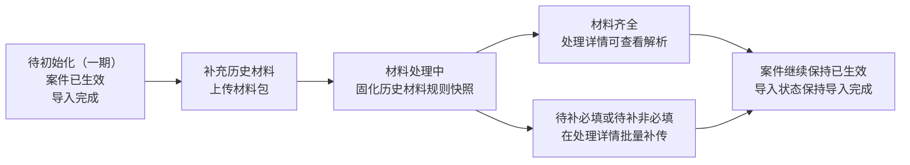

# 案件导入二期设计说明

**版本**：V2.0

**更新日期**：2026-07-22

**适用范围**：案件导入二期目标态原型
**一期边界**：一期 Excel 导入逻辑与已生效案件不回退、不改造原有后续法诉流程。

---

## 一、建设目标

二期在一期“仅 Excel 导入、字段校验通过即生成并生效案件”的基础上，补齐材料包上传、材料解析、材料补传、导入规则配置、批次级附件和完整处理明细能力。

核心目标如下：

1. 新批次在导入时同时完成订单数据和材料包处理，材料结果决定案件是否进入待委外。
2. 同一资产采购批次支持分次上传订单 Excel 和材料包，每次订单 Excel 最多 500 条，统一归属同一导入批次追溯。
3. 一期历史已生效案件可在二期补充材料，但不因材料缺失回退案件状态，也不影响待委外及后续法诉流程。
4. 运营通过导入处理详情闭环处理订单失败、待补材料和异常文件，无人工绑定、单文件上传或逐条重试入口。
5. 技术可按导入规则、规则快照和下载明细完成字段映射、材料识别和问题排查。

## 二、范围与不做事项

### 2.1 二期范围

| 模块 | 二期能力 |
| --- | --- |
| 案件导入管理 | 批次筛选、案件结果汇总、材料处理状态、编辑、下载明细、历史材料补充入口 |
| 新建导入批次 | 导入规则、资产明细、材料包、草稿、异步导入提示 |
| 导入处理详情 | 订单结果、待补材料、异常文件三个页签；批量补传和订单结果统一明细导出 |
| 导入规则配置 | Excel 字段映射、字段启用和必填、材料类别、材料名称及匹配模式 |
| 编辑批次信息 | 批次基础信息、批次附件、历史上传文件 |
| 状态机说明 | 批次、案件、材料状态口径及一期历史批次补材流程 |

### 2.2 不做事项

1. 不在案件导入模块新增“导出法诉材料”入口。材料齐全后仍由法诉材料模块沿用现有能力导出。
2. 不支持人工绑定订单、重新绑定、单个材料文件上传或异常文件逐条重试。
3. 不支持不同批次的重复订单覆盖。
4. 不对一期历史案件补材前的案件状态、待委外归属、委外和后续法诉流程做回退或重置。
5. 批次附件不参与订单材料解析、材料完整度校验或法诉材料自动归类。

## 三、核心数据与状态口径

### 3.1 三层状态

列表拆分展示三个维度，避免将批次处理、案件可用性和材料完整度混为一个状态。

| 维度 | 枚举 | 含义 |
| --- | --- | --- |
| 导入状态 | 草稿、导入中、导入完成、导入失败、已取消 | 批次任务的进度；不等同于订单案件状态 |
| 案件结果 | 已生效、待材料激活、导入失败 | 按订单编号去重后的案件处理结果 |
| 材料处理 | 未处理、未生成、材料处理中、材料齐全、待补必填、待补非必填、待初始化（一期） | 当前批次或订单的材料处理结果及下一步 |

### 3.2 二期新批次案件规则

| 场景 | 案件结果 | 材料处理 | 是否进入待委外 |
| --- | --- | --- | --- |
| 字段、金额、主续关系或不可覆盖重复订单校验失败 | 导入失败 | 未生成 | 否 |
| 字段校验通过，必填材料齐全 | 已生效 | 材料齐全 | 是 |
| 字段校验通过，缺少必填材料 | 待材料激活 | 待补必填 | 否；补齐并复核通过后自动生效 |
| 字段校验通过，仅缺非必填材料 | 已生效 | 待补非必填 | 是；可后续补传 |

### 3.3 一期历史案件兼容规则

一期历史批次的案件已按一期口径生效。二期补材只建立材料处理链路，不改变案件结果和导入状态。

| 历史材料状态 | 进入条件 | 列表更新 | 案件与导入状态 |
| --- | --- | --- | --- |
| 待初始化（一期） | 二期上线后，尚未补充历史材料 | 操作显示补充历史材料、编辑、下载明细 | 案件保持已生效；导入状态保持导入完成 |
| 材料处理中 | 上传材料包并提交 | 固化历史材料规则快照；操作改为处理详情、编辑、下载明细 | 案件保持已生效；导入状态保持导入完成 |
| 材料齐全 | 异步解析完成且材料满足规则快照 | 材料处理更新为材料齐全；处理详情、批次处理明细同步更新 | 案件保持已生效 |
| 待补必填 / 待补非必填 | 异步解析完成，存在缺失或异常材料 | 缺失项、异常文件写入处理详情和批次处理明细 | 一期历史案件仍保持已生效；在处理详情继续批量补传 |

首次补充历史材料仅上传材料包，格式支持 `zip`、`rar`、`7z`。由于此前没有材料识别结果，不展示“同步重新识别本批次历史异常文件”。

## 四、页面设计

### 4.1 案件导入管理

#### 查询条件

| 字段 | 匹配方式 | 说明 |
| --- | --- | --- |
| 导入批次号、批次名称 | 模糊查询 | 最多 50 字符 |
| 订单号 | 精确查询 | 命中批次内任一订单即返回所属完整批次 |
| 债权出让主体 | 模糊查询 | 取批次基础信息中的文本值 |
| 外部资产方、业务类型、导入状态 | 枚举筛选 | 业务类型当前仅租赁 |
| 首次导入时间 | 时间范围 | 取批次首次创建导入任务时间，后续补传不覆盖 |

#### 重点列与操作

1. 案件结果按订单编号去重，分别展示已生效、待材料激活、导入失败数量。
2. 材料处理仅表达材料下一步，不替代案件结果。
3. 非草稿批次操作采用两行展示：第一行“处理详情 + 编辑”，第二行“下载明细”。一期历史批次在待初始化时第一行展示“补充历史材料 + 编辑”；提交历史材料包后切换为“处理详情 + 编辑”。
4. 草稿仅展示继续编辑、取消；导入中不可编辑。
5. 下载明细下载“批次处理明细”，按订单处理、材料处理、异常文件和任务级异常记录当前批次的最新结果。

### 4.2 新建导入批次

头部字段除备注外均必填：批次名称、外部资产方、业务类型、导入规则、债权接收主体、债权出让主体、债权总额、债权对价。

| 字段 | 规则 |
| --- | --- |
| 债权出让主体 | 文本输入，最多 50 字符；用于批次级债权关系追溯和查询 |
| 债权接收主体 | 系统下拉，取债权主体配置 |
| 债权总额、债权对价 | 数字且不可为负；允许输入 0；债权对价不可大于债权总额 |
| 资产明细 | 必传，支持 `xlsx`、`xls`，单次最多 500 条订单 |
| 材料包 | 必传，支持 `zip`、`rar`、`7z` |
| 备注 | 非必填，最多 200 字 |

提交导入时，页面必填、金额、规则状态、Excel 和材料包通过前置校验后创建异步任务。弹出“导入处理中”提示，显示：处理阶段为“异步处理中”、页面提示为“导入中”；确认后返回案件导入管理列表查看任务进度，不自动下载明细。

保存草稿仅保存批次基础信息和临时文件，不解析、不生成案件。批次提交时固化导入规则快照，后续规则变化不回写已提交批次。

### 4.3 编辑批次信息

可修改：批次名称、债权出让主体、债权总额、债权对价、备注。不可修改：外部资产方、业务类型、导入规则、债权接收主体。

编辑弹框包含以下信息：

1. 历史上传文件：资产明细、材料包、失败重传文件的文件名、上传时间和处理结果。
2. 批次附件：用于债权转让协议、转账回单、补充协议等凭证；每批次最多 10 个，支持 `pdf`、图片、`xlsx`、`xls`、`zip`、`7z`、`rar`；支持下载、删除。替换附件时先删除旧附件，再通过“上传附件”新增。
3. 批次附件只作为批次凭证，不参与订单材料解析、材料完整度校验或材料类别匹配。

### 4.4 导入处理详情

导入处理详情作为当前批次的统一工作台。头部展示导入批次号、批次名称、外部资产方 / 业务类型、债权接收主体、债权出让主体、债权总额、债权对价、导入规则和导入时间；债权出让主体取当前批次基础信息。下方固定三个页签：

| 页签 | 展示内容 | 可操作项 |
| --- | --- | --- |
| 订单结果 | 已生效、待材料激活、导入失败、自动覆盖和重复跳过订单 | 查看解析、失败原因、查看覆盖记录、批量补传、导出当前筛选处理明细 |
| 待补材料 | 缺失的必填或非必填材料 | 勾选范围、批量补传 |
| 异常文件 | 无法识别订单归属或材料类别的文件 | 预览/下载、批量补传、按需同步重新识别 |

批量补传为同一批次的统一增量入口：可仅上传订单 Excel、仅上传材料包，或两者同时上传；至少上传一个文件。订单 Excel 用于新增本批次订单、重传失败订单或补充异常文件识别所需订单信息；材料包用于补齐材料或重新提交规范材料包。

### 4.5 导入规则配置

规则按“外部资产方 + 业务类型（租赁）”维护。规则包含：

1. Excel 模板字段配置：展示模板中文字段、对应表名与字段名、是否启用、是否必填；用于确认数据库字段映射。
2. 材料规则配置：标准材料类别、资产方材料名称、必填/非必填、匹配模式（精确/包含）。
3. 首租和续租共用一套 Excel 字段配置，仅在材料规则中切换和维护不同的必填材料范围。
4. 规则变化仅影响新批次；已提交批次使用规则快照，历史补材使用历史材料规则快照。

## 五、材料识别与补传规则

1. 材料包按订单编号、资产方材料名称、匹配模式和标准材料类别自动识别。
2. 能识别材料类别但不能识别订单，或订单不存在/已结清的文件进入异常文件页签。
3. 已生效订单仅允许补传当前规则中配置为非必填的材料；待材料激活订单可补必填和非必填材料。
4. 补齐必填材料并复核通过后，二期新批次的待材料激活案件自动生效。
5. 一期历史案件无论补材结果如何均保持已生效；材料状态用于补材待办和法诉材料完备性管理。
6. 一期历史材料首次上传不展示“同步重新识别历史异常文件”；该功能仅用于已有异常文件的二期批量补传。

## 六、重复订单与主续订单

### 6.1 重复订单

1. 同一 Excel 内出现重复订单编号：上传阶段阻断整份文件，不创建导入任务，提示“模板中有重复订单，请修正后重新上传。”
2. 不同批次中同一外部资产方、同一订单编号：直接阻断，提示已存在批次号，不进入覆盖判断。
3. 同一批次再次导入时，只有案件未分配且未流转的订单可自动覆盖：更新订单字段、替换同名文件、自动补充不同名文件。
4. 已分配或已流转订单不可覆盖，系统直接标记“重复跳过”，写入订单处理明细和批次处理明细并展示当前流转状态；不提供人工确认跳过入口。
5. 自动覆盖完成后提供“查看覆盖记录”。该入口只读展示覆盖批次、覆盖时间、覆盖条件、字段覆盖前后差异、同名文件替换和不同名文件补充结果，不会再次执行覆盖或修改案件。

### 6.2 主续订单

1. 首次导入续租订单时，关联主订单必须同批导入、主订单为已结清状态且客户证件号一致。
2. 主订单仅保留历史订单数据，不生成债权金额、已还金额、剩余未还、违约日、逾期天数等法诉债权字段。
3. 主订单已在法诉系统形成案件后，再导入对应续租订单时阻断，提示：`续租订单关联的主订单【{父订单编号}】已在法诉系统形成案件，不符合续租订单导入条件。`
4. 首次导入主订单后，不允许再导入对应续租订单；创新主订单债权金额口径为“主订单剩余未还租金 + 主订单到期买断金”。

## 七、下载明细与导出

1. 批次列表“下载明细”下载批次处理明细，反映当前批次多次导入后的最新处理结果。第一个Sheet为“订单处理明细”，运营可按“是否需补传”筛选待处理订单；“建议补传内容、待补材料”置于首次导入时间前，便于判断仅补订单Excel还是仅补材料包。后续为材料处理明细、任务级异常，最后一个Sheet为“错误分类说明”，沿用一期分类说明结构，并补充材料包、异常文件和规则快照等二期分类及提示文案。
2. 导入处理详情仅在订单结果页签展示“导出当前筛选处理明细”。该文件与批次下载明细统一为“订单处理明细、材料处理明细、任务级异常、错误分类说明”四个Sheet及相同字段口径。
3. 有勾选订单时，订单和材料Sheet仅导出勾选订单关联数据；未勾选时导出当前筛选订单关联数据。任务级异常和错误分类说明按当前批次保留。
4. 任务级异常在详情顶部提示，并写入批次处理明细；不单独增加页签。
5. 所有以上导出均不是“导出法诉材料”。法诉材料导出仍由法诉材料模块承接；一期历史案件在二期补充并解析材料后，可按该模块现有能力导出。

## 八、一期历史批次补材状态机

页面回写规则：

| 动作 | 材料处理更新 | 操作区更新 | 不变项 |
| --- | --- | --- | --- |
| 点击补充历史材料 | 不变 | 打开仅含材料包的补充弹框 | 案件已生效、导入完成 |
| 上传并提交材料包 | 待初始化（一期）→材料处理中 | 补充历史材料→处理详情；保留编辑、下载明细 | 案件结果、导入状态、待委外及后续流程 |
| 异步解析完成 | 材料齐全或待补必填/待补非必填 | 继续通过处理详情和批量补传处理 | 案件结果保持已生效；导入状态保持导入完成 |

## 九、验收要点

### 9.1 新批次

- [ ] 未上传资产明细或材料包时，整批阻断，不创建导入任务。
- [ ] 提交成功后展示异步处理中和导入中，不自动下载明细。
- [ ] 必填材料缺失时订单为待材料激活；补齐并复核后自动生效。
- [ ] 同批次分次上传的订单按订单编号去重统计，单次 Excel 不超过 500 条。

### 9.2 一期历史批次

- [ ] 初始材料状态为待初始化（一期），案件结果为已生效，导入状态为导入完成。
- [ ] 首次补充历史材料仅允许上传材料包，不展示同步重新识别历史异常文件。
- [ ] 提交材料包后材料状态变为材料处理中，操作区切换为处理详情、编辑、下载明细。
- [ ] 历史材料解析出待补必填时，案件仍保持已生效，不影响后续法诉流程。

### 9.3 处理与追溯

- [ ] 订单结果页签支持导出当前筛选处理明细；导出文件与批次下载明细统一为订单处理、材料处理、任务级异常、错误分类说明四个Sheet，待补材料和异常文件页签不展示导出按钮。
- [ ] 不可覆盖重复订单不可修改已有案件；可自动覆盖订单仅有查看覆盖记录入口。
- [ ] 查看覆盖记录不产生覆盖副作用，只展示审计明细。
- [ ] 批次附件最多 10 个，仅支持规定格式，支持下载、删除，不参与材料解析。

## 十、关联材料

- 二期原型：[案件导入原型主页](../../../index.html)
- Excel 模板：[法诉案件导入 Excel 模板及文件格式说明 0702 最终版](../../../法诉案件导入_Excel模板及文件格式说明0702_最终版.xlsx)
- 批次处理明细：[法诉案件导入批次处理明细](../../../法诉案件导入_批次处理明细.xlsx)
