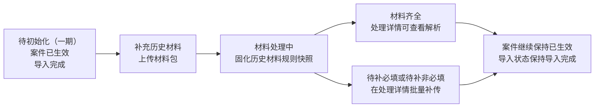

# 案件导入二期设计说明

**版本**：V2.0

**更新日期**：2026-07-29

**适用范围**：案件导入二期目标态原型
**一期边界**：一期 Excel 导入逻辑与已生效案件不回退、不改造原有后续法诉流程。

---

## 一、建设目标

二期在一期“仅 Excel 导入、字段校验通过即生成并生效案件”的基础上，补齐材料包上传、材料解析、材料补传、导入规则配置、批次级附件和完整处理明细能力。

核心目标如下：

1. 新批次在导入时同时完成订单数据和材料包处理，材料结果决定案件是否进入待委外。
2. 同一资产采购批次支持分次上传订单 Excel 和材料包，每次订单 Excel 最多 500 条，统一归属同一导入批次追溯。
3. 一期历史已生效案件可在二期补充材料，但不因材料缺失回退案件状态，也不影响待委外及后续法诉流程。
4. 运营通过导入处理详情闭环处理订单失败、待补材料和异常文件，无人工绑定、单文件上传或逐条重试入口。
5. 技术可按导入规则、规则快照和下载明细完成字段映射、材料识别和问题排查。

## 二、范围与不做事项

### 2.1 二期范围

| 模块 | 二期能力 |
| --- | --- |
| 案件导入管理 | 批次筛选、案件结果汇总、材料处理状态、编辑、下载明细、历史材料补充入口 |
| 新建导入批次 | 导入规则、资产明细、ZIP 材料包、异步导入提示 |
| 导入处理详情 | 订单结果、待补材料、异常文件三个页签；批量补传和订单结果统一明细导出 |
| 导入规则配置 | Excel 字段映射、字段启用和必填、材料类别、材料名称及匹配模式 |
| 编辑批次信息 | 批次基础信息、批次附件、历史上传文件 |
| 状态机说明 | 批次、案件、材料状态口径及一期历史批次补材流程 |

### 2.2 不做事项

1. 不在案件导入模块新增“导出法诉材料”入口。材料齐全后仍由法诉材料模块沿用现有能力导出。
2. 不支持人工绑定订单、重新绑定、单个材料文件上传或异常文件逐条重试。
3. 不支持不同批次的重复订单覆盖。
4. 不对一期历史案件补材前的案件状态、待委外归属、委外和后续法诉流程做回退或重置。
5. 批次附件不参与订单材料解析、材料完整度校验或法诉材料自动归类。

## 三、核心数据与状态口径

### 3.1 三层状态

列表拆分展示三个维度，避免将批次处理、案件可用性和材料完整度混为一个状态。

| 维度 | 枚举 | 含义 |
| --- | --- | --- |
| 导入状态 | 导入中、导入完成、导入失败 | 批次任务的进度；不等同于订单案件状态；未提交页面不创建批次 |
| 案件结果 | 已生效、待材料激活、导入失败 | 按订单编号去重后的案件处理结果 |
| 材料处理 | 未生成、材料处理中、材料齐全、待补必填、待补非必填、待初始化（一期） | 当前批次或订单的材料处理结果及下一步 |

### 3.2 二期新批次案件规则

| 场景 | 案件结果 | 材料处理 | 是否进入待委外 |
| --- | --- | --- | --- |
| 字段、金额、主续关系或不可覆盖重复订单校验失败 | 导入失败 | 未生成 | 否 |
| 字段校验通过，必填材料齐全 | 已生效 | 材料齐全 | 是 |
| 字段校验通过，缺少必填材料 | 待材料激活 | 待补必填 | 否；补齐并复核通过后自动生效 |
| 字段校验通过，仅缺非必填材料 | 已生效 | 待补非必填 | 是；可后续补传 |

### 3.3 一期历史案件兼容规则

一期历史批次的案件已按一期口径生效。二期补材只建立材料处理链路，不改变案件结果和导入状态。

| 历史材料状态 | 进入条件 | 列表更新 | 案件与导入状态 |
| --- | --- | --- | --- |
| 待初始化（一期） | 二期上线后，尚未补充历史材料 | 操作显示补充历史材料、编辑、下载明细 | 案件保持已生效；导入状态保持导入完成 |
| 材料处理中 | 上传材料包并提交 | 固化历史材料规则快照；操作改为处理详情、编辑、下载明细 | 案件保持已生效；导入状态保持导入完成 |
| 材料齐全 | 异步解析完成且材料满足规则快照 | 材料处理更新为材料齐全；处理详情、批次处理明细同步更新 | 案件保持已生效 |
| 待补必填 / 待补非必填 | 异步解析完成，存在缺失或异常材料 | 缺失项、异常文件写入处理详情和批次处理明细 | 一期历史案件仍保持已生效；在处理详情继续批量补传 |

首次补充历史材料仅上传材料包，且只支持 `zip`。由于此前没有材料识别结果，不展示“同步重新识别本批次历史异常文件”。

### 3.4 订单多次导入双轨状态机

订单多次导入同时维护两类结果，禁止用最后一次上传动作直接覆盖订单事实状态：

1. **订单当前最终状态**：订单结果页、案件导入列表和下载明细使用。只在产生新的有效结果时更新，失败尝试不回退已成立的最终状态。
2. **本次处理结果**：批次处理记录使用。每次上传独立记录成功、失败、覆盖或重复跳过，用于追溯本次操作。
3. 一期或二期原导入失败订单，仅补传 Excel 且字段校验通过、未上传材料包时，最终状态更新为“导入成功 + 待材料激活 + 待补必填”；不生成案件、不进入待委外，补齐必填材料后转为已生效。
4. 待材料激活订单后续 Excel 校验失败时，订单仍保持待材料激活和待补必填；本次字段失败只写入批次处理记录。
5. 已生效订单同批次再次导入：未分配且未流转时允许覆盖并重新计算最终状态；已分配或已流转时自动重复跳过，订单继续展示原案件和材料状态。
6. 跨批次重复订单在新批次阻断，新批次记录导入失败，不更新原批次订单状态。
7. 案件导入列表按订单编号去重统计最终状态，同一订单只计入已生效、待材料激活、导入失败中的一个数量；批次处理记录保留每次上传的独立成功或失败笔数。

## 四、页面设计

### 4.1 案件导入管理

#### 查询条件

| 字段 | 匹配方式 | 说明 |
| --- | --- | --- |
| 导入批次号、批次名称 | 模糊查询 | 最多 50 字符 |
| 订单号 | 精确查询 | 命中批次内任一订单即返回所属完整批次 |
| 债权出让主体 | 模糊查询 | 取批次基础信息中的文本值 |
| 外部资产方、业务类型、导入状态 | 枚举筛选 | 业务类型当前仅租赁 |
| 首次导入时间 | 时间范围 | 取批次首次创建导入任务时间，后续补传不覆盖 |

#### 重点列与操作

1. 案件结果按订单编号去重，分别展示已生效、待材料激活、导入失败数量。
2. 材料处理仅表达材料下一步，不替代案件结果。
3. 批次操作采用两行展示：第一行“处理详情 + 编辑”，第二行“下载明细”。一期历史批次在待初始化时第一行展示“补充历史材料 + 编辑”；提交历史材料包后切换为“处理详情 + 编辑”。
4. 导入中不可编辑；导入完成和导入失败可编辑批次信息或进入处理详情。
5. 下载明细按订单当前最终结果导出；每次上传的处理过程和失败结果另在批次处理记录中留痕。

### 4.2 新建导入批次

头部字段除备注外均必填：批次名称、外部资产方、业务类型、导入规则、债权接收主体、债权出让主体、债权总额、债权对价。

| 字段 | 规则 |
| --- | --- |
| 债权出让主体 | 文本输入，最多 50 字符；用于批次级债权关系追溯和查询 |
| 债权接收主体 | 系统下拉，取债权主体配置 |
| 债权总额、债权对价 | 数字且不可为负；允许输入 0；债权对价不可大于债权总额 |
| 资产明细 | 必传，支持 `xlsx`、`xls`，单次最多 500 条订单 |
| 材料包 | 必传，仅支持 `zip`；`rar`、`7z` 等格式在上传时拦截 |
| 备注 | 非必填，最多 200 字 |

提交导入时，页面必填、金额、规则状态、Excel 和材料包通过前置校验后创建异步任务。弹出“导入处理中”提示，显示：处理阶段为“异步处理中”、页面提示为“导入中”；确认后返回案件导入管理列表查看任务进度，不自动下载明细。

ZIP 必须可正常解压，且目录结构为“ZIP / 订单号文件夹 / 材料文件”。ZIP 至少包含一层订单文件夹；订单文件夹可以为空，但不允许继续嵌套子文件夹。Excel 字段校验通过后按订单号匹配文件夹，匹配到多个同订单号文件夹时仅处理首个，其余记录异常。目录前置校验不通过时整包阻断，不创建任务。

本期不提供保存草稿。点击取消仅放弃当前未提交内容并返回列表，不创建批次；点击导入并通过前置校验后才创建批次和异步任务。批次提交时固化导入规则快照，后续规则变化不回写已提交批次。

### 4.3 编辑批次信息

可修改：批次名称、债权出让主体、债权总额、债权对价、备注。不可修改：外部资产方、业务类型、导入规则、债权接收主体。

编辑弹框包含以下信息：

1. 历史上传文件：资产明细、材料包、失败重传文件的文件名、上传时间和处理结果。
2. 批次附件：用于债权转让协议、转账回单、补充协议等凭证；每批次最多 10 个，支持 `pdf`、图片、`xlsx`、`xls`、`zip`；支持下载、删除。替换附件时先删除旧附件，再通过“上传附件”新增。
3. 批次附件只作为批次凭证，不参与订单材料解析、材料完整度校验或材料类别匹配。

### 4.4 导入处理详情

导入处理详情作为当前批次的统一工作台。头部展示导入批次号、批次名称、外部资产方 / 业务类型、债权接收主体、债权出让主体、债权总额、债权对价、导入规则和导入时间；债权出让主体取当前批次基础信息。下方固定三个页签：

| 页签 | 展示内容 | 可操作项 |
| --- | --- | --- |
| 订单结果 | 已生效、待材料激活、导入失败、自动覆盖和重复跳过订单 | 查看解析、失败原因、查看覆盖记录、批量补传、导出当前筛选处理明细 |
| 待补材料 | 缺失的必填或非必填材料 | 勾选范围、批量补传 |
| 异常文件 | 无法识别订单归属或材料类别的文件 | 预览/下载、批量补传、按需同步重新识别 |

批量补传为同一批次的统一增量入口：可仅上传订单 Excel、仅上传材料包，或两者同时上传；至少上传一个文件。订单 Excel 用于新增本批次订单、重传失败订单或补充异常文件识别所需订单信息；材料包用于补齐材料或重新提交规范材料包。

### 4.5 导入规则配置

规则按“外部资产方 + 业务类型（租赁）”维护。规则包含：

1. Excel 模板字段配置：展示模板中文字段、对应表名与字段名、是否启用、是否必填；用于确认数据库字段映射。
2. 材料规则配置：标准材料类别、材料匹配名称（页面展示为资产方材料名称）、必填/非必填、匹配模式（精确/包含）。材料匹配名称用于匹配订单文件夹内的文件名，再确定标准材料类别。
3. 首租和续租共用一套 Excel 字段配置，仅在材料规则中切换和维护不同的必填材料范围。
4. 规则变化仅影响新批次；已提交批次使用规则快照，历史补材使用历史材料规则快照。
5. 电子签章材料增加“是否支持 e签宝验签截图”配置并关联外部资产方；创新资产方的合同大类材料需要生成 e签宝验签截图，供法诉材料模块后续导出。

## 五、材料识别与补传规则

1. 材料包按订单编号、材料匹配名称、匹配模式和标准材料类别自动识别。
2. 能识别材料类别但不能识别订单，或订单不存在/已结清的文件进入异常文件页签。
3. 待材料激活订单可补必填和非必填材料。已生效且未分配、未流转的订单可补必填和非必填材料，并按订单固化规则快照自动覆盖；已分配或已流转时自动跳过，不改变原状态。
4. 补齐必填材料并复核通过后，二期新批次的待材料激活案件自动生效。
5. 一期历史案件无论补材结果如何均保持已生效；材料状态用于补材待办和法诉材料完备性管理。
6. 一期历史材料首次上传不展示“同步重新识别历史异常文件”；该功能仅用于已有异常文件的二期批量补传。
7. 同步重新识别在本次 Excel 字段处理完成后执行，再结合本次材料和批次历史异常材料重新匹配；字段校验未通过的订单不解析材料。
8. 导入解析始终使用订单固化的规则快照；法诉材料导出项按导出时最新材料规则配置生成，导出入口仍在现有法诉材料模块。

## 六、重复订单与主续订单

### 6.1 重复订单

1. 同一 Excel 内出现重复订单编号：上传阶段阻断整份文件，不创建导入任务，提示“模板中有重复订单，请修正后重新上传。”
2. 不同批次中同一外部资产方、同一订单编号：直接阻断，提示已存在批次号，不进入覆盖判断。
3. 同一批次再次导入时，只有案件未分配且未流转的订单可自动覆盖：更新订单字段、替换同名文件、自动补充不同名文件。
4. 已分配或已流转订单不可覆盖，系统直接标记“重复跳过”。订单结果页和下载明细继续展示原案件及材料最终状态，本次重复跳过写入处理结果和批次处理记录；不提供人工确认跳过入口。
5. 自动覆盖完成后提供“查看覆盖记录”。该入口只读展示覆盖批次、覆盖时间、覆盖条件、字段覆盖前后差异、同名文件替换和不同名文件补充结果，不会再次执行覆盖或修改案件。同一订单发生多次覆盖时只保留最近一次覆盖结果；每次提交仍在批次处理记录中留痕。
6. 只有当前案件状态为已生效的订单再次上传并替换字段或材料时才记为覆盖。原导入失败或待材料激活订单后续处理成功属于状态更新，不生成覆盖记录。

### 6.2 主续订单

1. 首次导入续租订单时，关联主订单必须同批导入、主订单为已结清状态且客户证件号一致。
2. 主订单仅保留历史订单数据，不生成债权金额、已还金额、剩余未还、违约日、逾期天数等法诉债权字段。
3. 主订单已在法诉系统形成案件后，再导入对应续租订单时阻断，提示：`续租订单关联的主订单【{父订单编号}】已在法诉系统形成案件，不符合续租订单导入条件。`
4. 首次导入主订单后，不允许再导入对应续租订单；创新主订单债权金额口径为“主订单剩余未还租金 + 主订单到期买断金”。

## 七、下载明细与导出

1. 批次列表“下载明细”反映当前批次多次导入后的订单最终结果，统一包含“导入结果明细、待补材料明细、失败分类说明、口径说明”四个Sheet。
2. 导入处理详情仅在订单结果页签展示“导出当前筛选订单明细”。该文件与批次列表“下载明细”使用相同模板和字段口径。
3. “导入结果明细”按订单编号一单一行；“待补材料明细”按订单编号与缺失材料名称一项一行；“失败分类说明”和“口径说明”完整保留，便于运营排查和补传。
4. 有勾选订单时，前两张明细Sheet仅导出勾选订单关联数据；未勾选时导出当前筛选订单关联数据。
5. 所有以上导出均不是“导出法诉材料”。法诉材料导出仍由法诉材料模块承接；一期历史案件在二期补充并解析材料后，可按该模块现有能力导出。
6. 下载明细以订单当前最终结果为准。订单已处于“导入成功 + 待材料激活 + 待补必填”或“导入成功 + 已生效”时，后续再次上传 Excel 即使本次字段校验失败或因已流转而重复跳过，也不覆盖既有最终结果；本次处理结果保留在批次处理记录中。
7. 上述后续 Excel 校验失败仍需写入对应的批次处理记录，供运营追溯本次上传结果，但不回写订单最终结果。

## 八、一期历史批次补材状态机

```mermaid
flowchart LR
    A[待初始化（一期）\n案件已生效\n导入完成] --> B[补充历史材料\n上传材料包]
    B --> C[材料处理中\n固化历史材料规则快照]
    C --> D[材料齐全\n处理详情可查看解析]
    C --> E[待补必填或待补非必填\n在处理详情批量补传]
    D --> F[案件继续保持已生效\n导入状态保持导入完成]
    E --> F
```

页面回写规则：

| 动作 | 材料处理更新 | 操作区更新 | 不变项 |
| --- | --- | --- | --- |
| 点击补充历史材料 | 不变 | 打开仅含材料包的补充弹框 | 案件已生效、导入完成 |
| 上传并提交材料包 | 待初始化（一期）→材料处理中 | 补充历史材料→处理详情；保留编辑、下载明细 | 案件结果、导入状态、待委外及后续流程 |
| 异步解析完成 | 材料齐全或待补必填/待补非必填 | 继续通过处理详情和批量补传处理 | 案件结果保持已生效；导入状态保持导入完成 |

## 九、验收要点

### 9.1 新批次

- [ ] 未上传资产明细或材料包时，整批阻断，不创建导入任务。
- [ ] 材料包和历史补材压缩包仅接受 ZIP；RAR、7Z 等格式在上传时直接拦截。
- [ ] 新建页面不提供保存草稿；取消未提交内容后不创建批次，批次状态仅有导入中、导入完成、导入失败。
- [ ] 提交成功后展示异步处理中和导入中，不自动下载明细。
- [ ] 必填材料缺失时订单为待材料激活；补齐并复核后自动生效。
- [ ] 同批次分次上传的订单按订单编号去重统计，单次 Excel 不超过 500 条。

### 9.2 一期历史批次

- [ ] 初始材料状态为待初始化（一期），案件结果为已生效，导入状态为导入完成。
- [ ] 首次补充历史材料仅允许上传材料包，不展示同步重新识别历史异常文件。
- [ ] 提交材料包后材料状态变为材料处理中，操作区切换为处理详情、编辑、下载明细。
- [ ] 历史材料解析出待补必填时，案件仍保持已生效，不影响后续法诉流程。

### 9.3 处理与追溯

- [ ] 订单结果页签支持导出当前筛选订单明细；导出文件与批次下载明细统一为导入结果明细、待补材料明细、失败分类说明、口径说明四个Sheet，待补材料和异常文件页签不展示导出按钮。
- [ ] 不可覆盖重复订单不可修改已有案件；可自动覆盖订单仅有查看覆盖记录入口。
- [ ] 查看覆盖记录不产生覆盖副作用，只展示审计明细。
- [ ] 批次附件最多 10 个，仅支持规定格式，支持下载、删除，不参与材料解析。
- [ ] 待材料激活订单后续 Excel 校验失败时，批次处理记录保留本次失败，下载明细继续按订单最终结果展示导入成功、待材料激活、待补必填。

## 十、关联材料

- 二期原型：[案件导入原型主页](../../../index.html)
- Excel 模板：[法诉案件导入 Excel 模板及文件格式说明 0702 最终版](../../../法诉案件导入_Excel模板及文件格式说明0702_最终版.xlsx)
- 批次处理明细：[法诉案件导入批次处理明细](../../../法诉案件导入_批次处理明细.xlsx)
